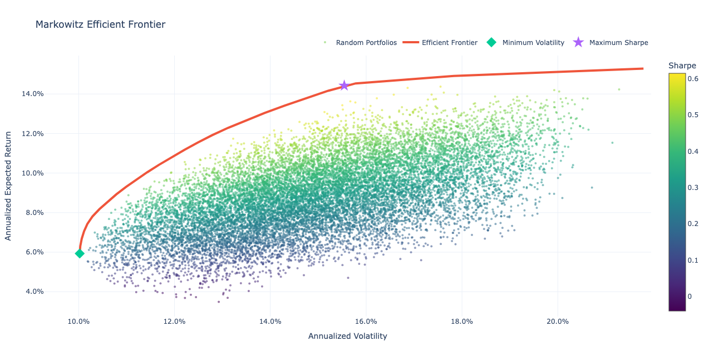
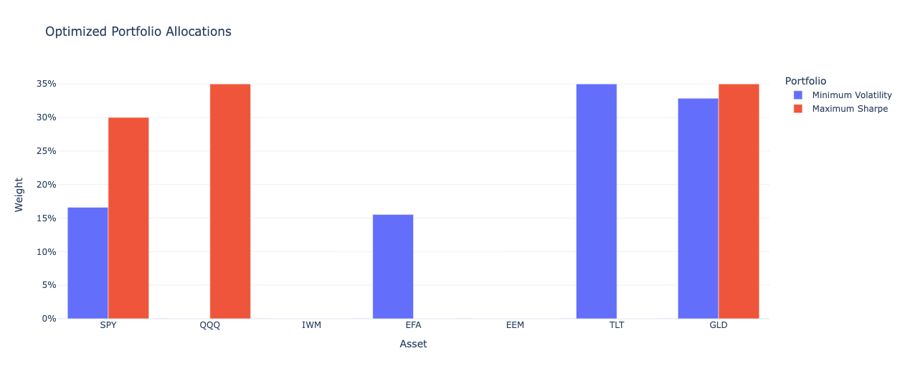
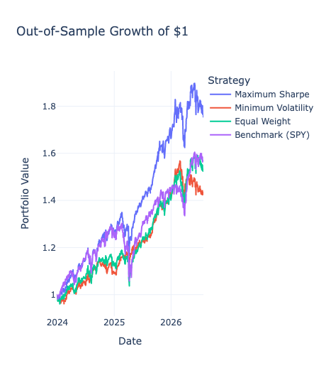
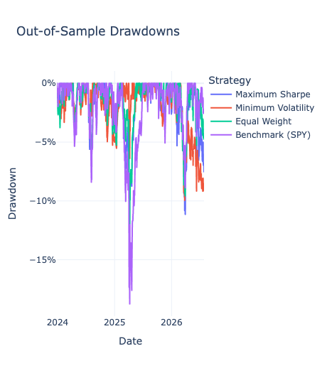

# Markowitz Portfolio Optimizer

Institutional-style portfolio optimization using Modern Portfolio Theory in Python.

## Features

- Multi-asset portfolio optimization
- Efficient Frontier
- Maximum Sharpe Ratio portfolio
- Minimum Volatility portfolio
- Monte Carlo portfolio simulation
- Ledoit-Wolf covariance shrinkage
- Out-of-sample backtesting
- Interactive Plotly visualizations

## Technologies

- Python
- pandas
- NumPy
- SciPy
- scikit-learn
- Plotly
- yfinance

## Data Source

- Yahoo Finance
## Visualizations

### Efficient Frontier

### Portfolio Allocations

### Growth of $1

## Results

This project generates:
- Efficient Frontier
- Portfolio allocation charts
- Correlation heatmap
- Growth of $1 backtest
- Performance metrics (Sharpe, Sortino, Calmar, Drawdown)

## Author

Abenezer Alemu
